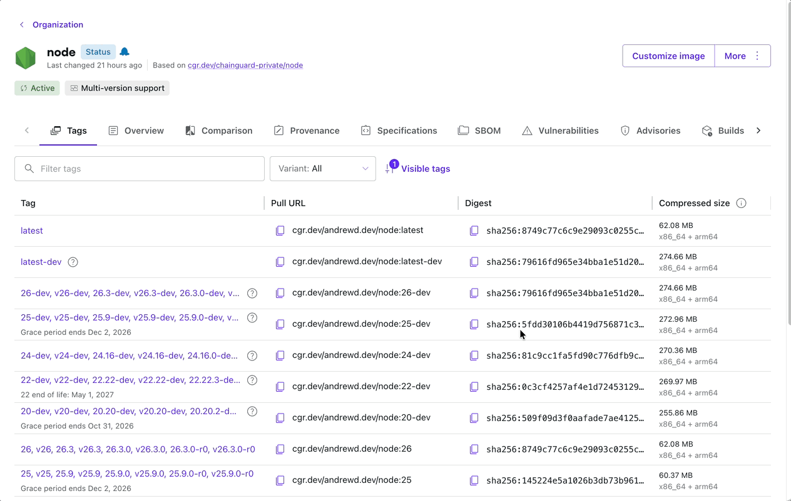

# Chainguard Container Security Workshop

A simple Express.js app demonstrating how to progressively harden a Node.js container from a public Docker Hub image to a Chainguard secure image, and from public npm packages to Chainguard's secure JavaScript libraries.

---

## The App

A minimal Express API with two endpoints:
- `GET /` returns a hello message
- `GET /health` returns health status

---

## Summary

| Step | Base Image | npm Source | Packages | CVEs | Package Manager | Shell |
|------|-----------|------------|----------|------|-----------------|-------|
| 1 | `node:24` (Docker Hub) | Untrusted (registry.npmjs.org) | 631 | 1,502 (56 critical, 385 high) | Yes | Yes |
| 2 | Chainguard `node:24-dev` (single-stage) | Untrusted (registry.npmjs.org) | 312 | 0 | Yes | Yes |
| 3 | Chainguard `node:24-slim` (multi-stage) | Untrusted (registry.npmjs.org) | 96 | 0 | No | No |
| 4 | Chainguard `node:24-slim` (multi-stage) | Chainguard Trusted Libraries (libraries.cgr.dev) | 96 | 0 | No | No |

---

## Step 1: Build the starting Dockerfile (public Docker Hub)

The baseline [Dockerfile](Dockerfile) uses the official `node:24` image from Docker Hub.

```bash
docker build -t demo-app:dockerhub .
docker run -p 3000:3000 demo-app:dockerhub
curl http://localhost:3000/health
```

> **Problem:** `node:24` contains hundreds of packages, a shell, package managers, and other tooling that your app never uses. More packages means a larger attack surface and more CVEs.

### CVE Scan Results

How many CVEs are in this image? Over 1,500! Including over 50 Critical and over 380 High.

```bash
$ grype demo-app:dockerhub
 ✔ Loaded image                                                                                                       index.docker.io/library/demo-app:dockerhub
 ✔ Parsed image                                                                          sha256:d5826d1f59cf3edb9a4316bd73481264feed65983e5cda2e24aa14a06054c477
 ✔ Cataloged contents                                                                           4c258485711bdbc2c65642196967c062bfe7e2aacc68760617e11d59b3f664a6
   ├── ✔ Packages                        [631 packages]
   ├── ✔ Executables                     [1,331 executables]
   ├── ✔ File metadata                   [19,701 locations]
   └── ✔ File digests                    [19,701 files]
 ✔ Scanned for vulnerabilities     [1502 vulnerability matches]
   ├── by severity: 56 critical, 385 high, 778 medium, 54 low, 918 negligible (421 unknown)
...
```

### Supply Chain Risk: registry.npmjs.org

How many dependencies did we install from registry.npmjs.org during this build?

Express alone pulls in ~30+ transitive dependencies, each one a separate package downloaded from npm with its own maintainer, publish pipeline, and potential for compromise. This number of dependencies will be the same through the rest of the steps.

```bash
docker run --rm --entrypoint find demo-app:dockerhub /app/node_modules -maxdepth 1 -mindepth 1 -type d | wc -l
69
```

---

## Step 2: Convert to Chainguard Node image (single-stage)

A single-stage swap of the base image. [Dockerfile.chainguard](Dockerfile.chainguard) uses `cgr.dev/andrewd.dev/node:24-dev`, a Chainguard image with only what's needed to build and run Node dependencies. The image is minimal by design but still includes a shell and package manager for the build. We'll remove those in Step 3.

```dockerfile
# Before
FROM node:24

# After
FROM cgr.dev/andrewd.dev/node:24-dev
```

```bash
docker build -f Dockerfile.chainguard -t demo-app:cg-single .
docker run -p 3000:3000 demo-app:cg-single
curl http://localhost:3000/health
```

> **Result:** Zero CVEs. The Chainguard `node:24-dev` image ships only what's needed to build and run Node dependencies. It still includes a shell and package manager. Let's fix that in Step 3.

### CVE Scan Results

```bash
$ grype demo-app:cg-single
 ✔ Loaded image                                                                                                                               demo-app:cg-single
 ✔ Parsed image                                                                          sha256:dde0cb7dcbb25d59e21b465b6f5476f472a32346a4d0849fb68cbf1ee45fc19b
 ✔ Cataloged contents                                                                           252517d400197113533d6fe9ecc2fa09d9a5e61fc1c5acbcefbc13322231dd9c
   ├── ✔ Packages                        [312 packages]
   ├── ✔ Executables                     [212 executables]
   ├── ✔ File metadata                   [6,562 locations]
   └── ✔ File digests                    [6,562 files]
 ✔ Scanned for vulnerabilities     [0 vulnerability matches]
   ├── by severity: 0 critical, 0 high, 0 medium, 0 low, 0 negligible
No vulnerabilities found
```

---

## Step 3: Convert to Chainguard Node image (multi-stage)

Use a multi-stage build so `npm install` runs in a builder image, and only the production artifacts are copied into the minimal runtime image. No package manager, no shell, no additional dependencies that aren't required. Less attack surface and less patching ongoing. See [Dockerfile.chainguard-multistage](Dockerfile.chainguard-multistage).

```dockerfile
# Build stage — includes npm
FROM cgr.dev/andrewd.dev/node:24-dev AS builder

WORKDIR /app
COPY package*.json ./
RUN npm install --omit=dev

# Runtime stage — minimal, no package manager, no shell
FROM cgr.dev/andrewd.dev/node:24-slim

WORKDIR /app
COPY --from=builder /app/node_modules ./node_modules
COPY index.js ./

EXPOSE 3000
ENTRYPOINT ["node", "index.js"]
```

```bash
docker build -f Dockerfile.chainguard-multistage -t demo-app:cg-multistage .
docker run -p 3000:3000 demo-app:cg-multistage
curl http://localhost:3000/health
```

> **Result:** Zero CVEs. The final image contains zero build tooling. Even `npm` is absent at runtime, eliminating an entire class of post-exploitation techniques.

### CVE Scan Results

```bash
$ grype demo-app:cg-multistage
 ✔ Loaded image                                                                                                                           demo-app:cg-multistage
 ✔ Parsed image                                                                          sha256:dc93a9d187318983567a1f57a82b208e238ab0b81837f2774403accebdb3c675
 ✔ Cataloged contents                                                                           b1edec643c9ad9d906cad44bf7aa0cdb7bc11b23b3e30dd8898040acc0d0dff2
   ├── ✔ Packages                        [96 packages]
   ├── ✔ Executables                     [41 executables]
   ├── ✔ File metadata                   [284 locations]
   └── ✔ File digests                    [284 files]
 ✔ Scanned for vulnerabilities     [0 vulnerability matches]
   ├── by severity: 0 critical, 0 high, 0 medium, 0 low, 0 negligible
No vulnerabilities found
```

---

## Step 4: Use Chainguard's secure JavaScript libraries

Even with a hardened image, your app's npm dependencies can carry malware or supply chain compromises. Chainguard Libraries provides a curated, audited npm registry. Packages are either built directly by Chainguard or sourced from a secure mirror with advanced malware scanning and cooldown periods. See [Dockerfile.chainguard-multistage-cg-libs](Dockerfile.chainguard-multistage-cg-libs).

Configure `.npmrc` to pull packages from Chainguard's registry:

```bash
$ chainctl auth configure-npm --pull-token
```

Then mount the `.npmrc` as a build secret so credentials are never baked into the image:

```dockerfile
RUN --mount=type=secret,id=npmrc,target=/app/.npmrc npm install --omit=dev
```

```bash
$ docker build -f Dockerfile.chainguard-multistage-cg-libs -t demo-app:cg-libraries .
$ docker run -p 3000:3000 demo-app:cg-libraries
$ curl http://localhost:3000/health
```

> **Result:** `express`, `dotenv`, and all 67 transitive dependencies are now sourced from Chainguard's verified registry. Packages are built, scanned, signed, and free of known malware before they ever reach your build. And of course, still Zero CVEs.

### CVE Scan Results

```bash
$ grype demo-app:cg-libraries
 ✔ Loaded image                                                                                                                            demo-app:cg-libraries
 ✔ Parsed image                                                                          sha256:b81bbb7108c8bd7a9f5d7ad7b8050f5f0b390e47ee6eae8e14dbe1c1ae2f0fa5
 ✔ Cataloged contents                                                                           0f3852ddcf7b941758964e0ddbb2f4e56bff115d9dfff1461183d1cf840d466a
   ├── ✔ Packages                        [96 packages]
   ├── ✔ Executables                     [41 executables]
   ├── ✔ File metadata                   [284 locations]
   └── ✔ File digests                    [284 files]
 ✔ Scanned for vulnerabilities     [0 vulnerability matches]
   ├── by severity: 0 critical, 0 high, 0 medium, 0 low, 0 negligible
No vulnerabilities found
```

### Library Verification

Verify which libraries were built directly by Chainguard. The remainder come from Chainguard's secure mirror where packages undergo advanced scanning by Chainguard Sentinel and mandatory cooldown periods before serving.

```bash
$ chainctl libraries verify demo-app:cg-libraries
Artifact: demo-app:cg-libraries
Verification Coverage: 93.24%
```

---

## Step 5 (Bonus): Customise the image with additional packages

The traditional way to add extra OS packages is:

```dockerfile
RUN apk add libvips
```

However this requires a package manager in the final image. There are ways to install via a package manager and copy the binaries and shared libraries into the runtime stage, but it gets messy fast.

Instead, Chainguard lets you customise your images using the [Custom Assembly](https://edu.chainguard.dev/chainguard/chainguard-images/features/ca-docs/custom-assembly/) feature. See [Dockerfile.chainguard-multistage-cg-libs-ca](Dockerfile.chainguard-multistage-cg-libs-ca) for an example.



Chainguard keeps the image up to date for you, rebuilding whenever the base image is updated or the packages you added receive updates. To use it, reference the new image repo in your Dockerfile. Both the `-dev` and runtime variants are available.

> **Result:** Your customised image is available with the packages you need in a distroless format, maintained by Chainguard.

Bonus Bonus: You can add your organisations custom certificates (not private certificates) to images using custom assembly in the same way. See [Custom Certificates](https://edu.chainguard.dev/chainguard/chainguard-images/features/ca-docs/custom-assembly-certs/)